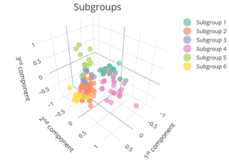

# COVID-19 subgroup discovery tool, application to the nCov2019 dataset

R code for the discovery of COVID-19 subgroups by symptoms and comorbidities, evaluated on the nCov2019 open dataset.

## Outline

The COVID-19 infectious disease has led since December 2019 to a worldwide pandemic which is still under control measures. Researchers worldwide are making huge efforts aiming to a comprehensive understanding of the COVID-19 and related healthcare treatments. This work shows the preliminary results of a Machine Learning (ML) approach to identify subgroups of COVID-19 patients based on their symptoms and comorbidities, aiming to a better understanding of variability of severity patterns. In this work, we particularly address the variability (or heterogeneity) between distinct sources populating the research repositories, given the potential impact that this variability may have in data science and the generalization of its results.

In this work, we analyzed the raw nCov-2019 dataset release at 2020-05-11. The [nCoV2019](https://github.com/beoutbreakprepared/nCoV2019) dataset comprises a collection of publicly available information on worldwide cases confirmed during the ongoing nCoV2019 outbreak. We included those cases were at least one symptom and an outcome were available. Then, we fixed duplicates and homogenized values in outcomes, comorbidities and symptoms. We mapped the latter to ICD-10 terms. The final sample included 170 cases.

Then, we applied a Multiple Correspondence Analysis 3-dimensional embedding of symptoms and outcomes and a hierarchical clustering. The proper number of clusters for both age-independent and age group analyses were selected by supervised inspection of group consistency.

We found clinically meaningful patient subgroups based on symptoms and comorbidities for specific age groups and age-independent analyses. However, the two most prevalent source countries were divided into separate subgroups with different manifestations of severity.

For further exploration of the results please visit our [COVID-19 Subgroup Discovery and Exploration Tool (COVID-19 SDE Tool)](http://covid19sdetool.upv.es/).

*3D embedding showing the resultant subgroups of COVID-19 cases in the nCov2019 dataset including all ages*

## How to use it

1. Download the whole repository.
2. Run the `covid19sdtool_notebook.Rmd` file or use your own script at the root directory following the [tutorial notebook](http://personales.upv.es/carsaesi/covid19sdetool/notebook.html) (which is the output of running the Rmd file).

## Documentation

* Tutoral notebook: [COVID-19 subgroup discovery on the nCov2019 dataset](http://personales.upv.es/carsaesi/covid19sdetool/notebook.html)

## Citation

If you use this code please cite:

Carlos Sáez, Nekane Romero, J Alberto Conejero, Juan M García-Gómez. Potential Biases in COVID-19 Machine Learning due to Data Source Variability. Submitted.

## Credits

* __Version__: 1.0.0
* __Authors__: Carlos Sáez (UPV), Nekane Romero (UPV), J Alberto Conejero (UPV), Juan M García-Gómez (UPV)
* __Maintainer__: Carlos Sáez (UPV-HMS)
 
Copyright: 2020 - Biomedical Data Science Lab, Universitat Politècnica de Valècia, Spain (UPV)

If you are interested in collaborating in this work please [contact us](mailto:carsaesi@upv.es).

